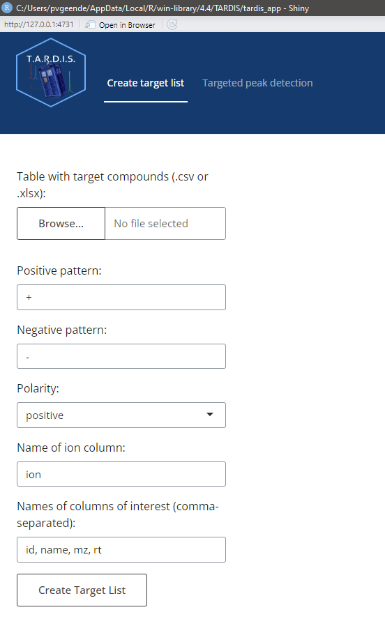
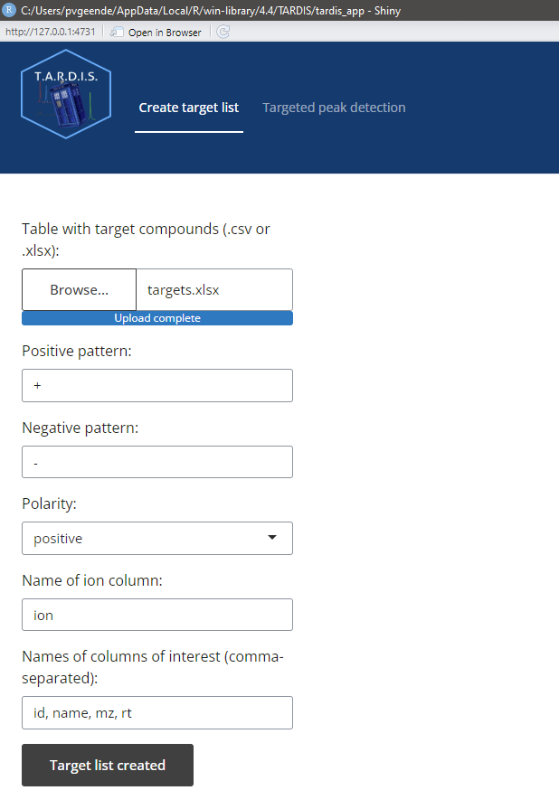
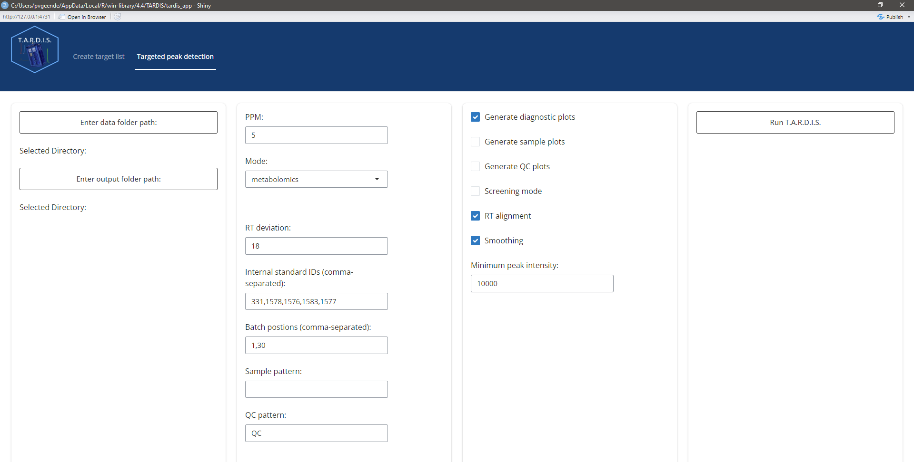
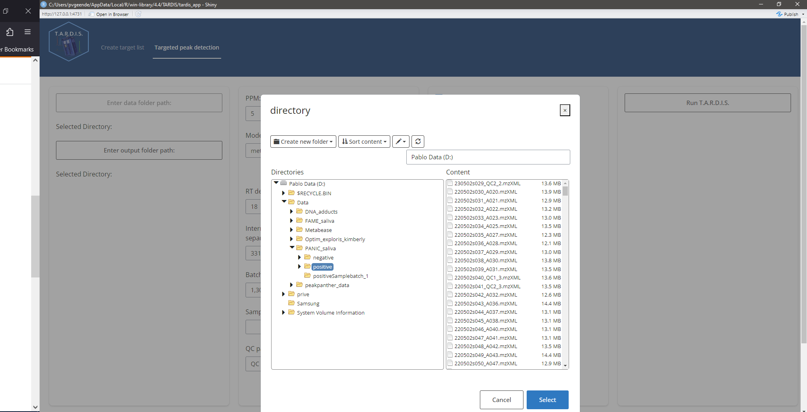

```{r setup, include = FALSE}
knitr::opts_chunk$set(
  collapse = TRUE,
  comment = "#>"
)
library(TARDIS)
```

# Introduction

`TARDIS` is an R package developed by Pablo Vangeenderhuysen at
LIMET, Ghent University. `TARDIS` offers an easy and
straightforward way to automatically calculate area under the peak, max
intensity and various quality metrics for targeted chemical compounds in
LC-MS data. It makes use of an established retention time correction
algorithm from the `xcms` package and loads MS data as `Spectra`
objects so it's easily integrated with other tools of the
*Rformassspectrometry* initiative.

See [README](https://github.com/pablovgd/TARDIS/blob/main/README.md) for installation instructions.

This tutorial explains the basic functionality of `TARDIS` and how
to use the Shiny GUI. It's advised to read this tutorial until the end before using `TARDIS` to understand how the tool works and what kind of input is needed.

# Targeted data processing with TARDIS

## File conversion

Input files need to be converted to the .mzML format and have to be centroided.
Polarity filtering is done within `TARDIS`, so no polarity subsetting has to be
performed when converting the files. For file conversion using MSConvert (ProteoWizard)
we refer to to mzmine documentation: https://mzmine.github.io/mzmine_documentation/data_conversion.html

## The general workflow

`TARDIS` was developed as an open-source alternative for targeted
peak integration using simple and interpretable algorithms. It's general
workflow is as follows: 

* Create a target list 
* Screening step 
* Retention time (RT) alignment of samples 
* Peak detection in QCs and adjustment of expected retention time
* Peak detection in samples 
* Calculate quality metrics of peaks and summarize results

### Creating a target list

The first step is creating a `data.frame` that describes the chemical
compounds. Following columns at least need to be present for each
compound: 

* A compound ID, a unique identifier 
* A compound Name 
* Theoretical or measured *m/z* 
* Expected RT (in minutes) 
* A column that indicates the polarity of the formed ion for that compound

Extra columns can be included in the file, but will be ignored by
`TARDIS` unless otherwise indicated.

An input file (either .xlsx or .csv) can be converted to a correct
data.frame using the `createTargetList()` function (not needed if using
the GUI). Input parameters needed are: the path to the file, the
patterns for positive and negative ionization, the polarity of interest,
the columnn that contains the ionization mode and the other columns of
interest.

An example:

Input file looks like this (first 6 rows):

```{r echo=FALSE}
library(readxl)
input <- read_excel("vignette_data/targets.xlsx")
kableExtra::kable(head(input))
```

The target `data.frame`  is created:

```{r}

targets <- createTargetList("vignette_data/targets.xlsx",
                            pos_pattern = "+",
                            neg_pattern = "-",
                            polarity = "positive",
                            ion_column = "ion",
                            columns_of_interest = c("id", "name", "mz", "rt"))

kableExtra::kable(head(targets))
```

### Screening and adjusting expected retention time

In this step, 5 QC runs are processed to check if provided expected
retention time is precise enough for consistent integration. These 5 QCs
are automatically picked and will represent beginning, middle and end of
the analysis. If the analysis is suffering from retention time drift
and/or the compound is not eluting at its expected RT, this will become
apparent in this quick screening. If necessary, changes can be made to
the input targets table and one can proceed to processing all samples
and results.

To perform this screening step, in the GUI "screening mode" should be
checked or when using the command line, the argument `screening_mode`
should be `TRUE`.

An example of a compound for which the retention time could be adjusted
is shown in Figure 1.

If retention shift is too severe and can not be be mediated by the retention time correction step (see next section), it can happen that a peak from a QC run in the beginning of the analysis will barely be in the same window as a peak from a QC run at the end of the analysis. To resolve this, performing the processing in different "batches" is advised, see later for details. 


From the above figure and our knowledge of the compound, we can see that the compound is present, but eluting later than expected. Adjusting the expected RT in the targets file makes sure the compound is visible in our window and integration will happen correctly. See Figure 2.


### Retention time alignment


In order to deal with RT shift in longer analyses, a RT correction/sample alignment is done based on found peaks of internal standard compounds in quality control (QC) samples. The alignment is performed using the `adjustRtime()` function from `xcms` using the `PeakGroupsParam` parameter: this performs retention time correction based on the alignment of features defined in all/most samples (corresponding to house keeping compounds or marker compounds) (Smith 2006). In our case, these house keeping compounds are manually defined to be the internal standard compounds as they should always be present and have good quality peaks. This is done with the `peakGroupsMatrix` parameter. For more details: https://github.com/sneumann/xcms/issues/715


Plots below show results for two components in 5 QC runs without RT correction (left) and with RT correction (right).

```{r echo=FALSE, alignment1, fig.show='hold', out.width="45%"}


par(mar = c(4, 4, .1, .1))
knitr::include_graphics(
  c("vignette_data/plots/not_aligned_180.png",
    "vignette_data/plots/aligned_180.png"))


```

```{r echo=FALSE, alignment2, fig.show='hold', out.width="45%"}

par(mar = c(4, 4, .1, .1))
knitr::include_graphics(
  c("vignette_data/plots/not_aligned_181.png",
  "vignette_data/plots/aligned_181.png"))

```


### Peak detection in QC's and adjusting expected RT


Based on the expected RT, target compounds are integrated in
quality control samples. As said, in severe cases of RT shift, RT correction sometimes isn't able to align all samples throughout the whole analysis. 
This behavior should be visible after running screening mode, if QCs from beginning and end of the analysis aren't properly aligned, it might be advised to run the analysis in batches.
To deal with a different expected RT per batch, target compounds are first integrated in the QCs from that batch, after which expected RT is adjusted to the RT at which the compounds are retrieved (or almost retrieved) in the QCs. In the next step, all runs (QCs and samples) in that batch are processed with the adjusted RT.

An example: in the Figures below, the compound is clearly eluting at a different time in QC runs at the beginning of the analysis (left), compared to QC runs at the end of the analysis (right).
In order to avoid having to manually provide expected RT for every batch, `TARDIS` will detect that the peak apex is now closer to a RT of 440 seconds (7.3 minutes) and thus when finally processing that batch the expected RT for that compound will be approximately 440 seconds instead of 446 seconds. 

```{r echo=FALSE, rtshift, fig.show='hold', out.width="45%"}

par(mar = c(4, 4, .1, .1))
knitr::include_graphics(
  c("vignette_data/plots/rtshift1.png",
  "vignette_data/plots/rtshift2.png"))

```

### Peak detection in samples

Finally, after setting the new expected RT, peaks are integrated in all samples (and QCs). The user can choose to get plots for all components in all samples and QCs (plotted in groups of 5 samples, see example below).

```{r echo=FALSE, out.width="45%"}

par(mar = c(4, 4, .1, .1))
knitr::include_graphics("vignette_data/plots/sample_plot.png")
```


### Quality metrics and output files

The following files will be created in the chosen output folder:

* Folders with desired plots (Diagnostic plots, QCs, samples)
* A feature overview table with average metrics of the compounds in the QC runs
* Result tables with different attributes of each compound in each sample:
    + Area under the curve (auc_table)
    + Max peak intensity (int_table)
    + Correlation score (peakcor_table)
    + Points over the peak (pop_table)
    + Signal to noise (snr_table)
    

The signal to noise and correlation score are adapted from [Kumler et al. (2023)](https://bmcbioinformatics.biomedcentral.com/articles/10.1186/s12859-023-05533-4).
From the publication, these two metrics showed to be the best predictors of actual peak quality, and thus can be useful to screen for compounds that are consistently low quality and/or need to be defined as "Not Found". 

Currently filtering results using the GUI is only available based on max intensity. 


## Starting the GUI

First, after installation, load the package:

```{r eval=FALSE, include=TRUE}
library(TARDIS)
```


To launch the GUI run:

```{r eval=FALSE, include=TRUE}
runTardis()
```

The Shiny GUI will open in an RStudio window or your browser:


```{r echo=FALSE, out.width="60%"}

par(mar = c(4, 4, .1, .1))

```

### Creating a target list

In the tab "Create target list", one can adjust the following parameters:

* Input table with target compounds, in .csv or .xlsx format
* The pattern that is unique for compounds forming positive ions, to be found in the ion column
* The pattern that is unique for compounds forming negative ions, to be found in the ion column
* The name of the ion column in which to retrieve the pattern
* The columns of interest one wants to retain in the output (id,name,mz and rt are mandatory)


Pressing "Create Target List" after filling in the parameter fields will create a target list and pass it through for the next part. 

```{r echo=FALSE, out.width="60%"}

par(mar = c(4, 4, .1, .1))

```


### Targeted peak detection

In the tab "Targeted peak detection", one can adjust the following parameters:

* Data folder path containing the .mzML files

* Folder path to store the output

* PPM: allowed *m/z* error in ppm

* Custom mass range: In case of analysis with multiple mass-ranges at different time windows: enter the desired mass window, see quick start vignette.

* RT deviation: search window visible to the peak picking algorithm around the expected RT (e.g. 18 means +- 9 seconds around the expected RT)

* Internal standard IDs: IDs of the internal standard compounds that will be used for RT alignment

* Batch positions: in pairs, the beginning and end position of files in a batch. E.g. 1,20,21,40 means that file 1 up to and including 20 are in batch 1, and file 21 up to and including 40 are in batch 2

* Sample pattern: if .mzML files of sample runs have a unique identifier, indicate it here, if nothing is entered, all .mzML files that DO NOT have the QC identifier are marked as sample

* QC pattern: entern the pattern unique for QC .mzML files

* Generate diagnostic plots: create diagnostic plots of 5 QCs automatically selected from beginning, middle and end of the analysis

* Generate sample plots: create plots for all the compounds in all the sample runs

* Generate QC plots: create plots for all the compounds in all the QC runs

* Screening mode: fast processing mode that only processes 5 QC runs from beginning, middle and end of analysis

* RT alignment: wether or not to perform RT alignment.

* Smoothing: apply smoothing (attention! this also means that the quality metrics are computed for the smoothed peaks and not the raw data). For a first and honest look at data quality, I would advise to leave this off. 

* Minimum peak intensity: a minimum maximum intensity threshold for the peaks. Peaks with a maximum intensity less than the threshold are excluded from the results (NA in results table).


```{r echo=FALSE}

par(mar = c(4, 4, .1, .1))

```

```{r echo=FALSE}

par(mar = c(4, 4, .1, .1))

```

During processing, wait patiently:

```{r echo=FALSE}

par(mar = c(4, 4, .1, .1))
knitr::include_graphics("vignette_data/screenshots/processing.png")
```

When processing is finished, a message will appear:

```{r echo=FALSE}

par(mar = c(4, 4, .1, .1))
knitr::include_graphics("vignette_data/screenshots/processing_done.png")
```

# Issues and feature requests

`TARDIS` will receive periodical updates including improvements and/or new features based on the need of the users. If you encounter an error, or any other problem, feel free to create an issue on Github. Got an idea yourself to improve `TARDIS`? Feature requests are also more than welcome. 

https://github.com/pablovgd/TARDIS/issues

